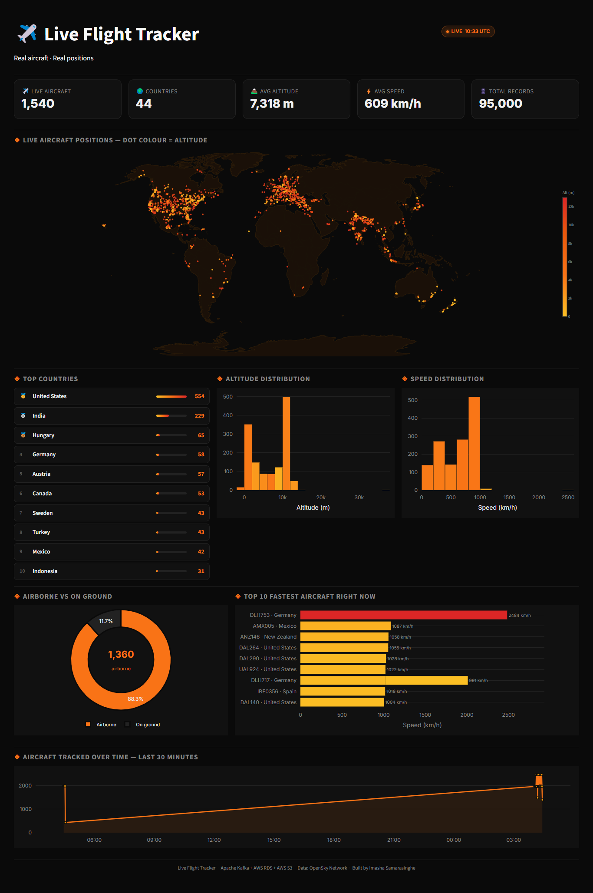
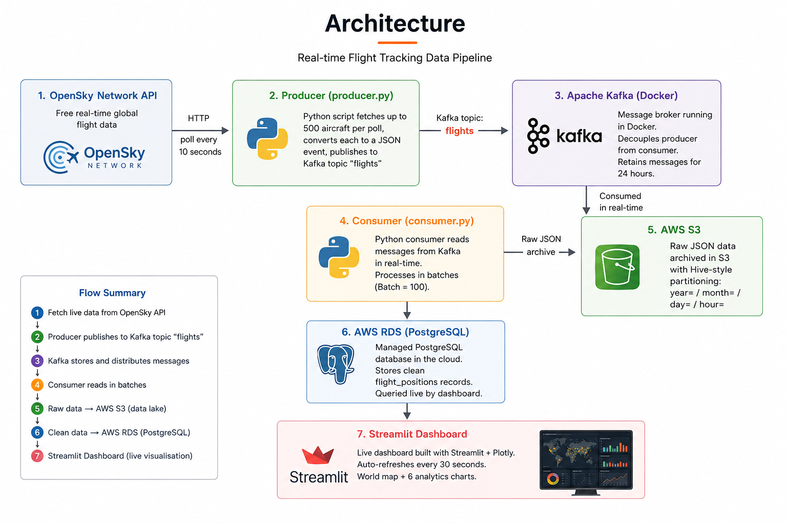

# ✈️ Live Flight Tracker

A real-time data engineering project that streams live aircraft data using Apache Kafka, stores it in AWS cloud services, and visualises it on a live dashboard.



---

# 🚀 Features

- Live global aircraft tracking
- Apache Kafka streaming pipeline
- AWS RDS PostgreSQL database
- AWS S3 raw data archive
- Real-time Streamlit dashboard
- Interactive world map and analytics charts
- Docker-based Kafka setup

---

# 🏗️ Architecture


---

# 🛠️ Tech Stack

| Technology | Purpose |
|---|---|
| Python | Main programming language |
| Apache Kafka | Streaming pipeline |
| Docker | Kafka container setup |
| AWS RDS PostgreSQL | Cloud database |
| AWS S3 | Raw JSON storage |
| Streamlit | Dashboard |
| Plotly | Visualisations |
| OpenSky API | Flight data source |

---

# 📂 Project Structure

```text
flight-tracker/
│
├── assets/
│   └── dashboard.png
│
├── scripts/
│   ├── producer.py
│   ├── consumer.py
│   └── flight_dashboard.py
│
├── docker-compose.yml
├── requirements.txt
├── .env.example
├── README.md
```

---

# ⚙️ Setup

## 1. Clone repository

```bash
git clone https://github.com/YOUR_USERNAME/flight-tracker.git
cd flight-tracker
```

---

## 2. Create virtual environment

### Windows

```bash
python -m venv venv
venv\Scripts\activate
```

### Mac/Linux

```bash
python3 -m venv venv
source venv/bin/activate
```

---

## 3. Install requirements

```bash
pip install -r requirements.txt
```

---

## 4. Configure environment variables

Create `.env` using `.env.example`.

---

## 5. Start Kafka

```bash
docker-compose up -d
```

---

## 6. Run producer

```bash
python scripts/producer.py
```

---

## 7. Run consumer

```bash
python scripts/consumer.py
```

---

## 8. Run dashboard

```bash
streamlit run scripts/flight_dashboard.py
```

Open:

```text
http://localhost:8501
```

---

# ☁️ AWS Services Used

## AWS RDS PostgreSQL
Stores processed flight records.

## AWS S3
Stores raw JSON flight data.

---

# 📊 Dashboard Includes

🌍 Live Aircraft Map
Real-time global aircraft positions
Colour-coded altitude visualization
Hover tooltips with callsign, speed, and altitude
🏆 Top Countries
Countries with the most aircraft currently tracked
🏔️ Altitude Distribution
Histogram showing aircraft altitude ranges
⚡ Speed Distribution
Histogram of aircraft speed in km/h
🍩 Airborne vs On Ground
Donut chart comparing airborne and grounded aircraft
🛸 Top 10 Fastest Aircraft
Live ranking of fastest aircraft currently tracked
📈 Aircraft Trend Over Time
Aircraft captured per minute over the last 30 minutes
---

# 📡 Data Source

Flight data provided by:

https://opensky-network.org

---

# 👨‍💻 Author

Built by **Imasha Samarasinghe** as part of a data engineering portfolio project.
